# Skip Logic (Survey Branching)

This comprehensive guide introduces you to the functionalities and applications of our survey platform's 'Survey Branching' feature. Also known as 'Conditional Branching' or 'Skip Logic,' this feature allows for tailoring your survey to respondents based on their answers. This personalization enhances the survey's effectiveness by directing participants to specific questions or sections based on prior responses.

## Single-Selection

### The “Add Skip Logic” Option

The `Add Skip Logic` button will only be visible on a question card when there are more than two questions in a survey, and will only be visible for three different types of survey questions:

- Single-selection
- Multi-selection 
- Dropdown questions

For the last question in this survey, the add skip logic will not appear. 

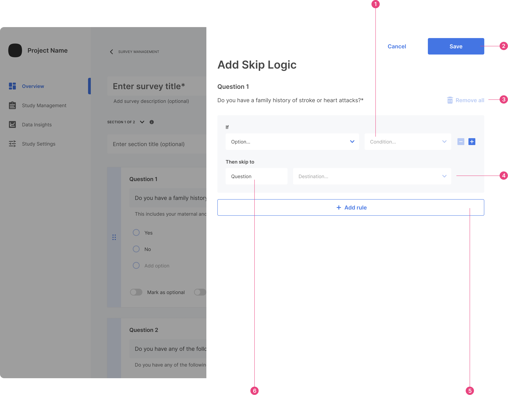

1. When there’s only 1 Condition inside a Rule, the “-” button is disabled to prevent users from removing the last Condition.
   The “+” button is always enabled to help users add more Conditions with or without an existing edited Condition.
   GENERAL RULE: Changing the dropdown choice won’t affect the unselected dropdowns or those in another type (Condition/Destination) or before.
2. The “Save” button is always enabled; clicking this button with an unfilled dropdown will trigger the corresponding error state.
3. When there’s only one empty rule, the “Remove all” button will be disabled.
4. The default state of a Rule box:
   - The “Option...” dropdown is enabled while the rest are disabled.
   - The rest of the dropdowns will only be enabled when the dropdown before it has been filled with a user selection.
5. Please see the “Delete Rule” flows in its dedicated space.
6. The “Question” label will be displayed if the survey is without a section.

### The “Option” Dropdown.

The dropdown will display all the options that users have entered so far. If users haven’t entered any option, or there are any empty options, then display “Option X” based on the absolute sequence of the option in the list. (The same logic as displaying empty options in survey preview)

### Enable "Remove All"

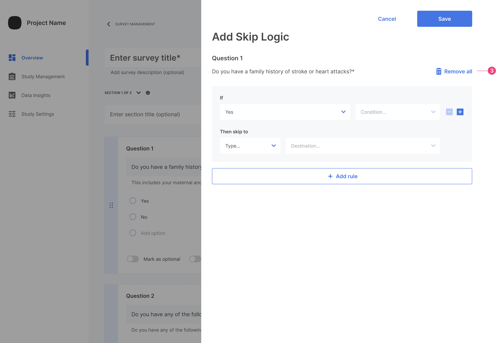

Once the existing rule becomes non-empty, the “Remove all” button will be enabled.

### The "Condition" Dropdown

There will be different condition options for different question types. Please refer to the documentation for expected dropdown options here.

### The “Destination...” Dropdown

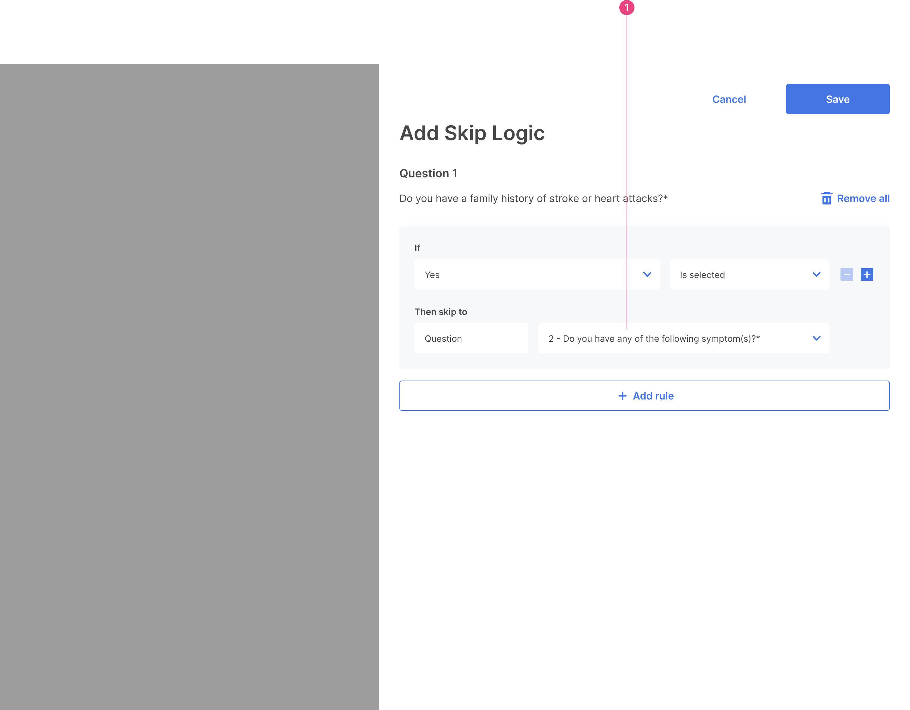

- If users select “Question” as the destination type, then display “[Question Number] - [Question title]” except the current question & the question before it.
- If users select “Section” as the destination type, then display the “[Section Number] - [Section title]” except the one that the current question belongs to.

### The "Edit Skip Logic" Feature

1. The button will change to “Edit skip logic” once users save their changes to the default logic. If users remove all the changes later, the button will change back to “Add skip logic.”
2. After saving the skip logic, users will see the toast feedback of its successful save.

The previously saved content will be displayed when users click “Edit Skip Logic” to edit the logic.

## Single-Selection for Sections

A section consists of a group of questions. Skip logic can be applied to a section.

After clicking the "Add Skip Logic" button, you should see something like this:

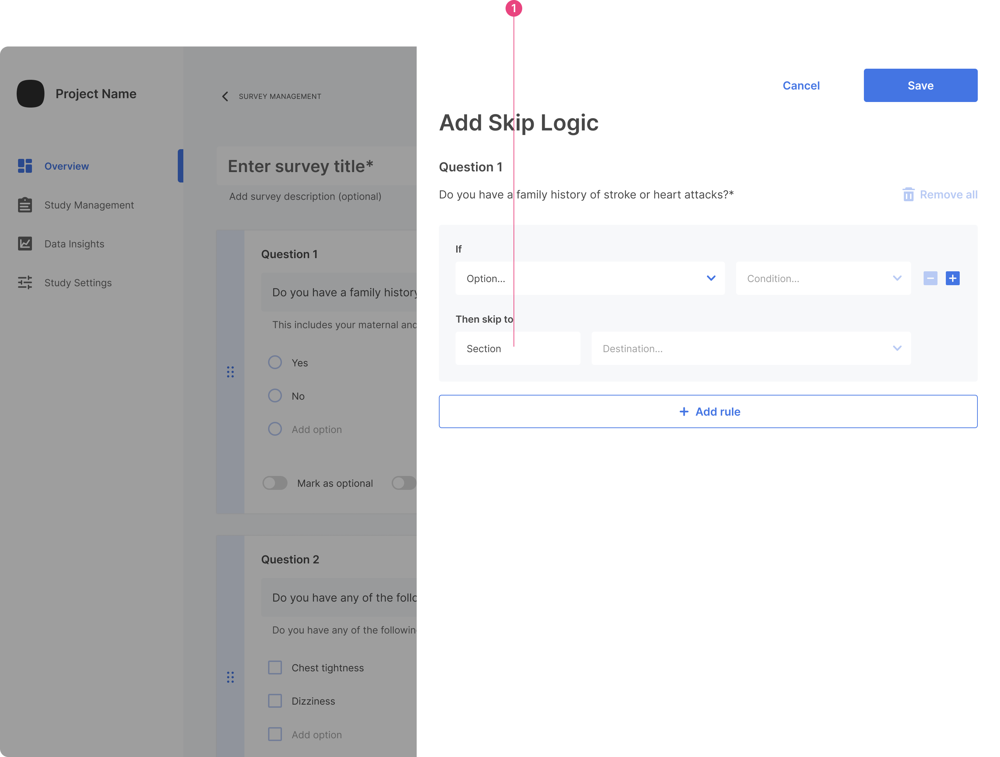

The “Section” label will be displayed if the survey is sectioned.

#### Saving Skip Logic for Section

1. When users add skip logic to a question in a SECTIONED survey, a mandatory section will be automatically added after the question. This newly added section will group all the subsequent questions until the 1st question of the next section (if any). If the question with added skip logic is the last question of a section, then no new section will be added.
2. A toast message will appear every time a new section is added due to a newly added skip logic.

#### Help Chart

Here is a chart that explains the three possibilities:

## Multi-Selection

### Single Condition

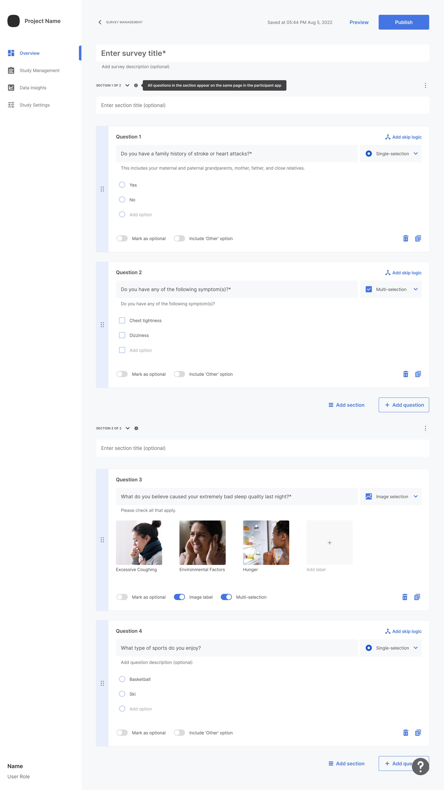

Once the *Add Skip Logic is clicked*, you will see the following screen:

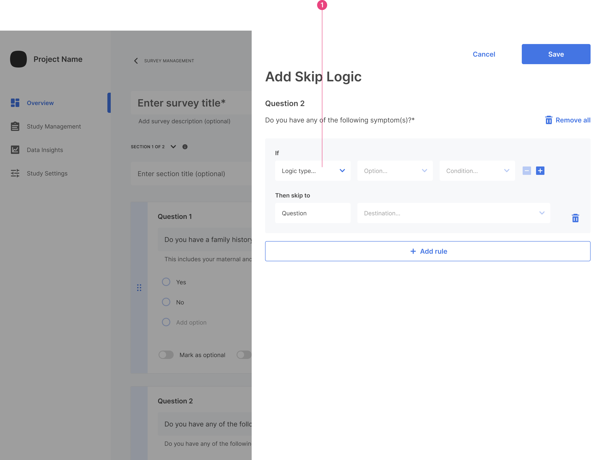

The logic type dropdown will have two different options for multi-selection questions.

- ***Specific Option*** creates the rule based on a selected option.
- ***Option Count*** creates the rule based on the number of options selected.

#### The “Logic type...” Dropdown

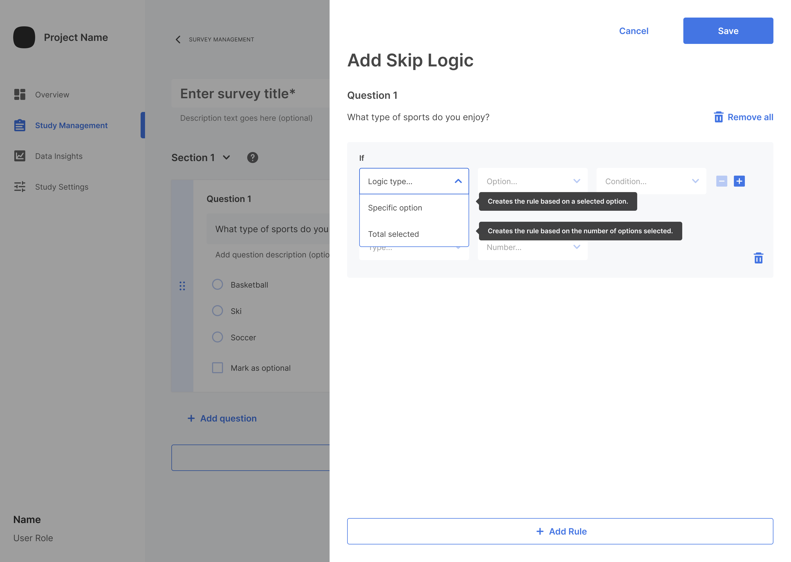

##### The “Specific Option.”

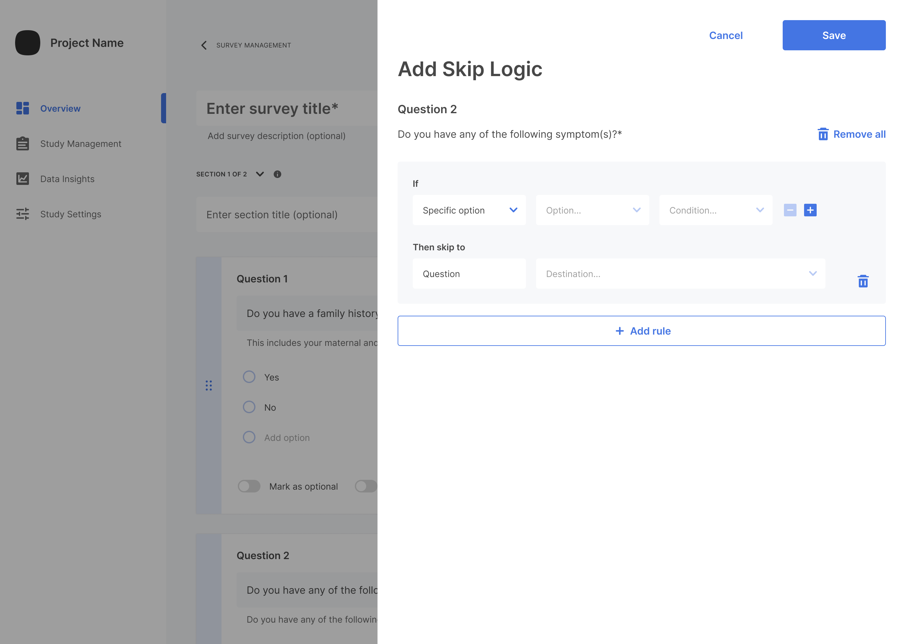

Selecting "Specific Option" will unlock the options dropdown.

##### The “Option” Dropdown

The dropdown will display all the options that users have entered so far. If users haven’t entered any option, or there are any empty options, then display “Option X” based on the absolute sequence of the option in the list. (The same logic as displaying empty options in survey preview).

##### The “Condition” Dropdown

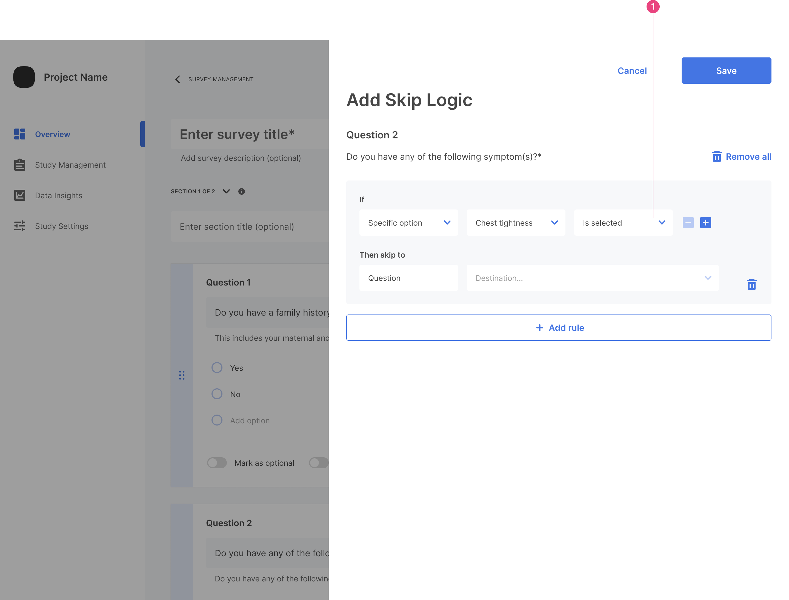The “Select condition...” dropdown here has the same options as the single-selection, which are

- Is selected
- Is not selected

###### The Skip Logic Destination

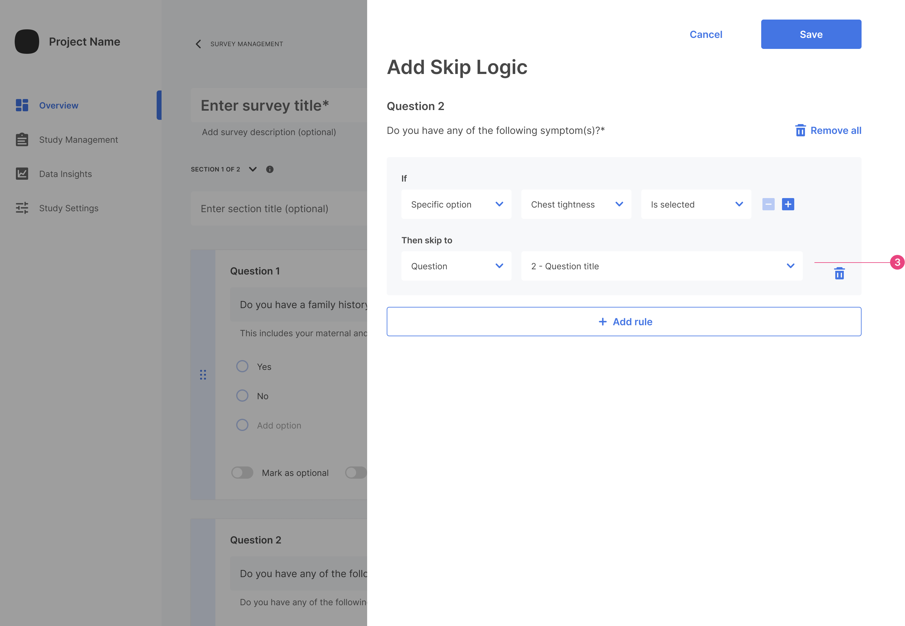

- If the question has no title when this dropdown is being edited, we display ”[Q#] -’ Question title’ ” e.g., 2 - Question title
- If the section has no title when this dropdown is being edited, we display ”[S#] -’ Untitled’ ”e.g., 4 - Untitled

#### The “Option Count” Dropdown

The “Select condition...” dropdown will have the following options

- Is equal to
- Is not equal to
- Is greater than
- Is greater than or equal to
- Is less than
- Is less than or equal to

##### The “Number” Dropdown

The “Number...” dropdown allows users to select a certain number for the condition. 

##### The Skip Logic Destination

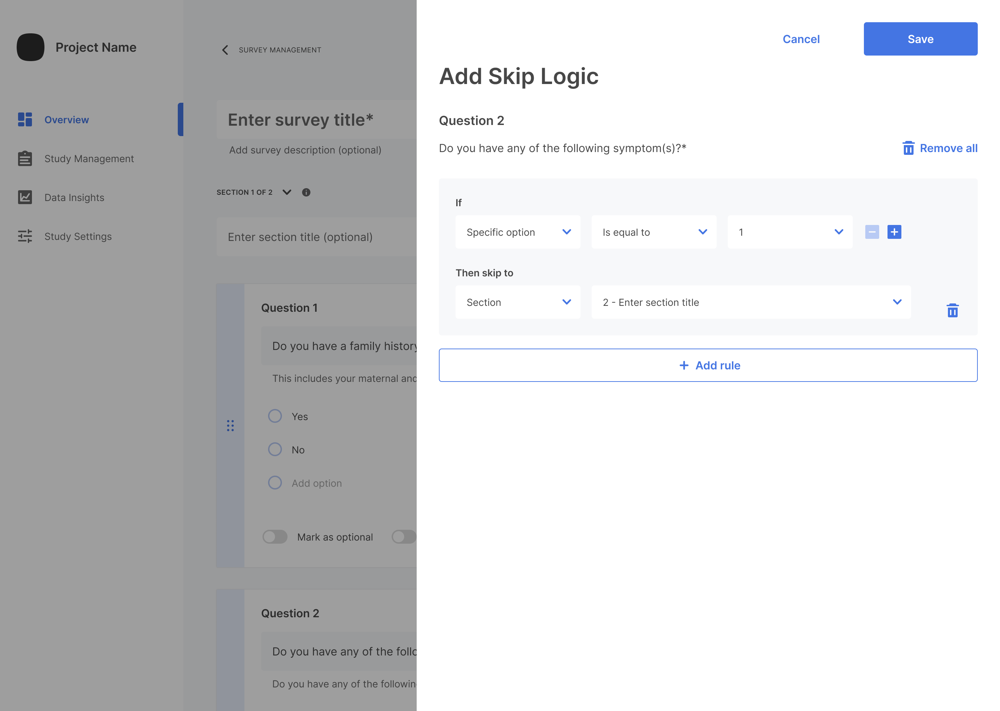

- If the question has no title when this dropdown is being edited, we display ”[Q#] -’ Question title’ ” e.g., 2 - Question title
- If the section has no title when this dropdown is being edited, we display ”[S#] -’ Untitled’ ”e.g., 4 - Untitled

### Multiple Conditions

#### The “+” Icon

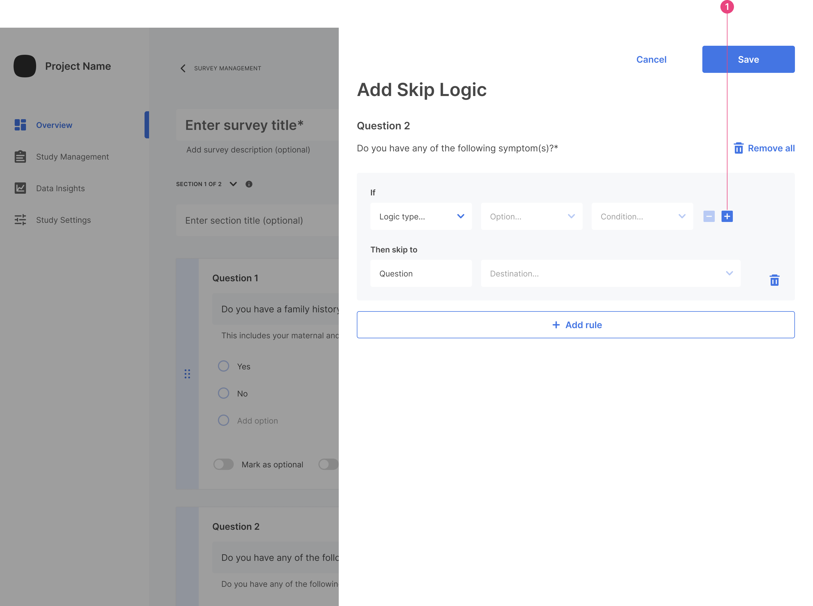

Click "+" to add a condition inside a rule. Here is an example of two conditions. 

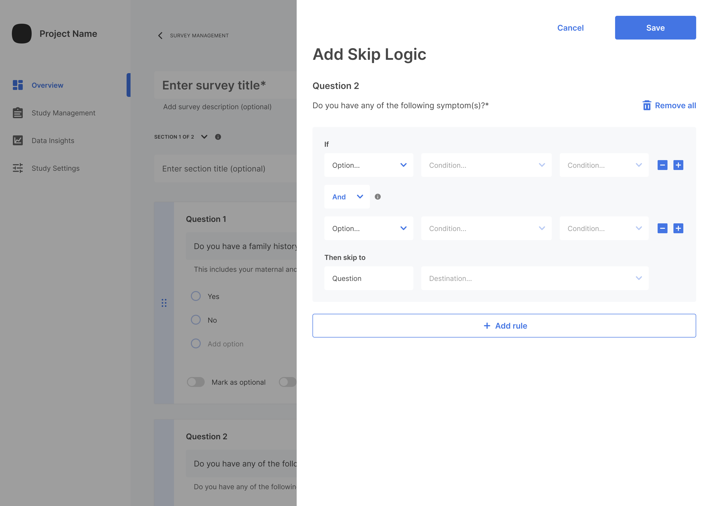

The same screen filled out:

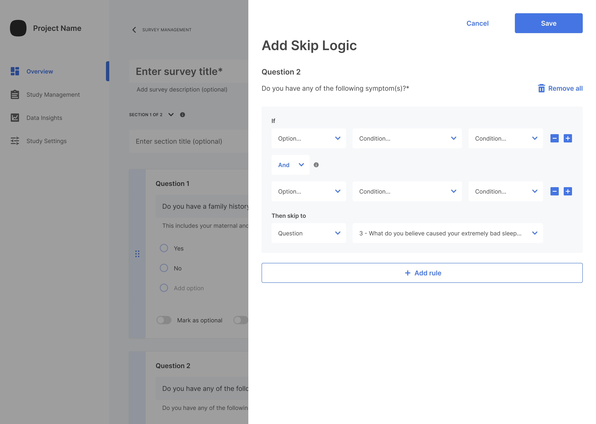